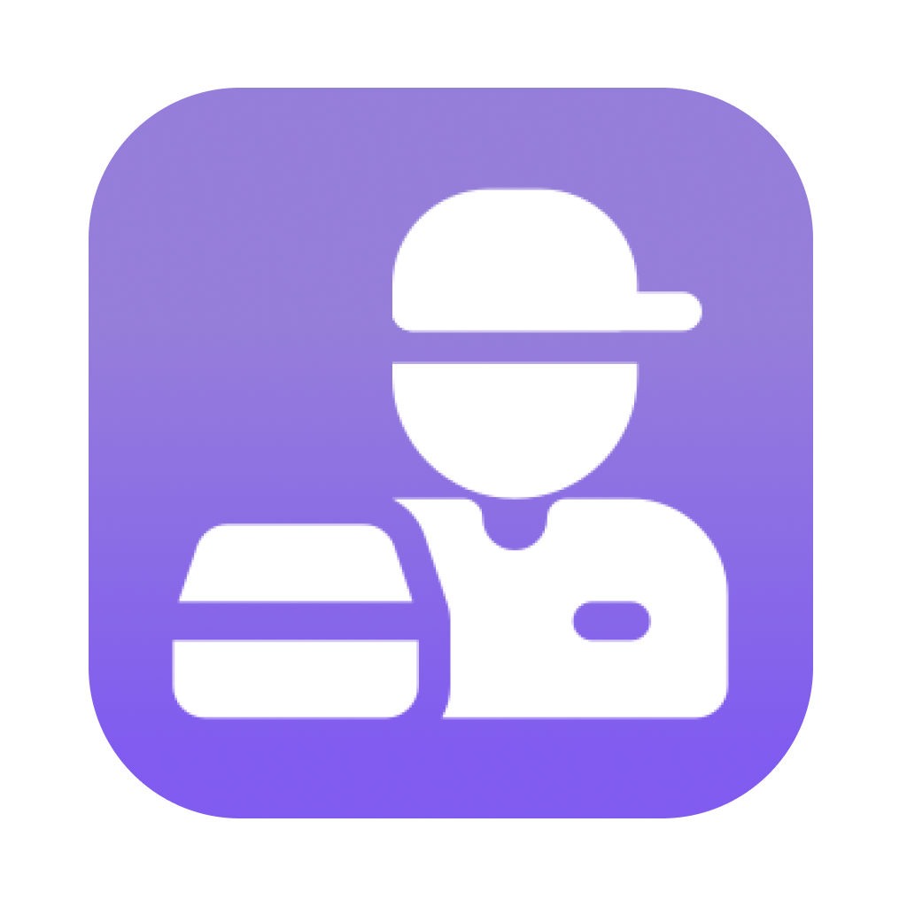

<!-- Documentation start -->

  
  <h1 align="center">DeliverEase</h1>

<!-- Old logo-->
<!--</a>-->

  
  

  
  </img>
  </img>
  </img>
  </img>

### Empowering Delivery Partners, Connecting Communities
</a>

>DeliverEase is an innovative platform **designed to empower delivery partners** and foster **seamless connections between buyers and sellers** without the need for intermediaries. With a **user-friendly interface** and **efficient processes**, DeliverEase aims to **revolutionize the way goods are delivered**, making it convenient for both consumers and businesses.

<!--TODO: Product Image start-->

<!--TODO: Product Image end-->

> **Note**\
> DeliverEase is currently in development. You can find our badges [**here**](https://github.com/TeamCodeArena/DeliverEase/blob/main/Status.md)

## Table of Contents
- [Introduction](#introduction)
- [How it Works](#how-it-works)
  - [Order Placement](#order-placement)
  - [Post a Job](#post-a-job)
  - [Acceptance and Delivery](#acceptance-and-delivery)
- [Key Features](#key-features)
- [Getting Started](#getting-started)
- [Contributing](#contributing)
- [Feedback](#feedback)
- [License](#license)
- [How you can reach us](#social-media)

## Introduction
DeliverEase is built on the foundation of **empowering delivery partners**, enabling them to earn income while providing **efficient delivery services** to the community. By **bridging the gap between buyers and sellers directly**, DeliverEase eliminates the need for intermediaries, leading to **faster deliveries** and **reduced costs**.

## How it Works  

### Order Placement 
1. **Click Order:** To place an order, Buyers can click on the **"Order Something" button** on the homepage, which will lead them to the **order details page**

2. **Enter Delivery Details:** On the order details page, the Buyer can specify the **delivery location**, **preferred delivery time**, and any **additional information** relevant to the delivery

3. **Pickup Information:** They can also **provide pickup details**, including the **location and time** when the delivery partner should collect the item for delivery

4. **Submit Order:** After providing all the necessary information, the Buyer can **submit the order request**

### Post a Job 
1. **Post a Job:** Sellers can post delivery jobs by **clicking on the "Post a Job" option on the homepage**

2. **Job Details:** They must **enter the job specifics**, including the **item to be delivered**, **pickup location**, **delivery location**, and **expected delivery time**

3. **Delivery Partner Assignment:** Once the job is posted, the nearest available delivery partner will have the option to accept the job **`(algorithms are still to be developed)`**

### Acceptance and Delivery 
1. **Delivery Partner Selection:** The nearest available delivery partner can **view available jobs and accept** the ones that match their location and schedule

2. **Order Confirmation:** Once the delivery partner accepts the job the delivery process will begin

3. **Delivery Execution:** The delivery partner will **collect the item from the buyer's specified pickup location** and **deliver it to the buyer's specified delivery address**

4. **Confirmation from both sides:** You will get an **OTP at our website**, tell that to seller so that we can know that this order is completed

5. **Delivery Completion:** Once the delivery is successfully completed, both the buyer and seller will **receive notifications of the successful order**

## Key Features
- Empowerment of delivery partners to **earn income on flexible schedules** 
- Direct **connection between buyers and sellers** without middlemen 
- Efficient and **seamless order placement process** 
- Post a Job feature for buyers to **find suitable delivery partners**
- **Real-time job acceptance** 
- **Convenient pickup and drop-off services**
- **No tracking system** to ensure user privacy 

## Getting Started
To get started with DeliverEase using Django, follow these steps:
- **Clone the repository:** `git clone https://github.com/TeamCodeArena/DeliverEase`
- **Navigate to the project directory:** `cd DeliverEase`
- **Install the dependencies:** `pip install -r requirements.txt`
- **Make migrations with the command:** `python manage.py makemigrations`
- **Migrate the migrations made:** `python manage.py migrate`
- **Start the Django development server:** `python manage.py runserver`

Now, you should have the **DeliverEase Django application** up and running locally. You can access it by visiting **http://127.0.0.1:8000/** in your web browser. 
Please note that this is a **simplified installation guide** **assuming you have Django and Python already set up on your system.** If you encounter any issues during the installation process, make sure to check Django's official documentation or reach out for support. Happy delivering!

## Contributing 
<!-- TODO: Link Contribiute.md -->
We welcome contributions from the community to enhance DeliverEase. If you want to contribute, follow the steps in the [**`Contributing.md`**](Contributing.md) file.

## Feedback 
We value feedback to improve our platform continuously. If you have any suggestions or encounter any issues, please [**open an issue**](https://github.com/TeamCodeArena/DeliverEase/issues).

## License 
<!-- TODO: Link LICENSE.md -->
DeliverEase is released under the [**MIT License**](https://opensource.org/licenses/MIT). 
See [**`LICENSE.md`**](LICENSE) for more information.

## Github Wiki
You can see our Github wiki here: 

## Related Projects
<table>
  <tr>
    <td align="center">
      <a href="https://github.com/TeamCodeArena/deliverease.app">
      
      
&nbsp;&nbsp;&nbsp;&nbsp;deliverease.app&nbsp;&nbsp;&nbsp;&nbsp;

      </a>
    </td>
  </tr>
</table>

</a>

---

Thank you for choosing DeliverEase! We hope this platform enhances your delivery experience and connects communities in a meaningful way. Happy delivering!

  <a href="#top" style="text-decoration: none; background-color: #007BFF; color: white; display: inline-flex; align-items: center; justify-content: center; padding: 10px 20px; border-radius: 50%;">
    
    Back to Top
  </a>

<!-- Documentation end -->
